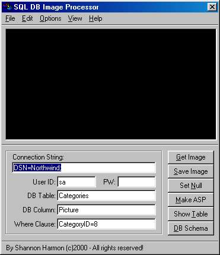



## SQL Database Image

### Description

Allow easy input and retrieval of images into an SQL database. Includes class file for easy implementation into your own program and a second project based on making the class into a dll for a IIS server. Will allow you to show pictures from you database on a webpage, input pictures into a database, remove the picture, retreive the picture plus more...
 
### More Info
 
Must have reference to ADO 2.1 in your project, sample project uses VB 6.0 SP3 controls. Please read the readme.txt file for more information.

             |
---                |---
**Submitted On**   |2000-04-21 22:04:54
**By**             |[Shannon Harmon](https://github.com/Planet-Source-Code/PSCIndex/blob/master/ByAuthor/shannon-harmon.md)
**Level**          |Intermediate
**User Rating**    |4.3 (30 globes from 7 users)
**Compatibility**  |VB 5\.0, VB 6\.0, ASP \(Active Server Pages\) 
**Category**       |[Databases/ Data Access/ DAO/ ADO](https://github.com/Planet-Source-Code/PSCIndex/blob/master/ByCategory/databases-data-access-dao-ado__1-6.md)
**World**          |[Visual Basic](https://github.com/Planet-Source-Code/PSCIndex/blob/master/ByWorld/visual-basic.md)
**Archive File**   |[CODE\_UPLOAD50574212000\.zip](https://github.com/Planet-Source-Code/shannon-harmon-sql-database-image__1-7476/archive/master.zip)

